## Table of contents

* [Identifying Whole Genome Duplication](#WGD)
* [Extracting orthogroups](#ortho)
* [Mapping gene duplications - filter base on bootstrap](#mrca)
* [Mapping gene duplications - filter base on concordant clades](#concon)
* [Identifying ILS and gene flow](#phytop)
* [Inferring phylogenetic networks](#phylonet)
* [Choosing the optimal number of reticulation - model selection](#model)

#### How to login to the workstation

	ssh -p 22110 USERNAME@10.153.134.10

### Every time you see `$USERNAME` in the example command, you need to replace it with your own [USERNAME](https://github.com/dfmoralesb/MPEP_tutorials_2026) 

* To avoid having to change the `$USERNAME` for every command, you can set a variable to provide the name of it. ***Do this every time you connect to the workstation***

	For example, for me, Diego, my user name is `mpemaster`
	
		USERNAME=mpemaster

## Identifying Whole Genome Duplication using a tree-based approach

* We are going to map gene duplications based on the method of Yang et al. 2015. For more details, see [here](https://academic.oup.com/mbe/article/32/8/2001/2925547)

	To map polyploidy events in the reference tree, first extracted orthogroups are extracted from each homolog tree. When two or more taxa overlap between the two daughter clades, a gene duplication event is recorded to the most recent common ancestor (MRCA) on the subclade species tree. In this procedure, each node on a species tree can be counted at most once per orthogroup to avoid nested gene duplications inflating the number of duplications scored. 

	
	

	

## Extracting orthogroups
	
* We first need to extract rooted orthogroups from homolog trees

	Orthogroups are rooted ingroup lineages separated by outgroups that include the complete set of genes in a lineage from a single copy in their common ancestor.

	We are going to use the final homolog trees from the Phylogenomics tutorial. This files are located in `/data_tmp/$USERNAME/output/04_analyses/07_final_homologs`
	
	The script to extract orthogroups is `/data_tmp/$USERNAME/script/extract_clades.py`
	
		python /data_tmp/$USERNAME/script/extract_clades.py

	You should see
	
		Usage:
		python extract_clades.py inDIR treefileending outDIR MIN_INGROUP_TAXA in_out output_name
		
	It requires the homolog trees directory, the file extension for the tree files, the minimum number of taxa (same as before; we can use 8 as we did for orthology inference), the table assigning taxa to the ingroup or outgroup (the same you use for orthology inference), and an output extension file.
	
	Let's make a new directory for the analyses and for the orthogroups
	
		cd /data_tmp/$USERNAME/data/07_phylogenomic_analyses
		
		mkdir -p 13_wdg/00_orthogroups
		
		cd 13_wdg/
		
	Now, let's extract the orthogroups
	
		python /data_tmp/$USERNAME/script/extract_clades.py /data_tmp/$USERNAME/output/04_analyses/07_final_homologs treefile 00_orthogroups 8 ../in_out_list.txt orthogroup
		
	You should see 
	
		27 ingroup taxa and 3 outgroup taxa read
		Ingroups: ['MELI_Aglaia_spectabilis', 'MELI_Aphanamixis_polystachya', 'MELI_Azadirachta_indica', 'MELI_Cabralea_canjerana', 'MELI_Carapa_procera', 'MELI_Cedrela_montana', 'MELI_Cedrela_saltensis', 'MELI_Chisocheton_longistipitatus', 'MELI_Chukrasia_tabularis', 'MELI_Dysoxylum_alliaceum', 'MELI_Guarea_pubescens', 'MELI_Heckeldora_staudtii', 'MELI_Lovoa_sywnnertonii', 'MELI_Melia_azedarach', 'MELI_Munronia_pinnata', 'MELI_Neoguarea_glomerulata', 'MELI_Owenia_reticulata', 'MELI_Pterorhachis_zenkeri', 'MELI_Quivisianthe_papinae', 'MELI_Schmardaea_microphylla', 'MELI_Swietenia_macrophylla', 'MELI_Swietenia_mahagoni', 'MELI_Toona_ciliata', 'MELI_Trichilia_hirta', 'MELI_Turraeanthus_manii', 'MELI_Turraea_virens', 'MELI_Vavaea_amicorum']
		Outgroups: ['RUTA_Citrus_hystrix', 'RUTA_Melicope_ternata', 'RUTA_Ruta_graveolens']
		5116.iqtree.treefile
		1 clades extracted
		5163.iqtree.treefile
		1 clades extracted
		6483.iqtree.treefile
		...
		
	Now you can count to see how many orthogroups you extracted
	
		ls 00_orthogroups/*.orthogroup | wc -l
		
	It should be `335`
	

## Mapping gene duplications - filter based on bootstrap support

	
* Now, you can map the orthogroups to the reference map. In this case, we will use the rooted concatenated tree from the previous tutorial (the one you rooted for Phyparts) `meliaceae_MO_500_8_concat_IQtree.treefile.rr`

	This script will filter orthogroups by requiring an average bootstrap percentage of each orthogroup to be at least 70% 

	The script you will use is `/data_tmp/$USERNAME/script/extract_clades.py/map_dups_mrca.py`
	
		python /data_tmp/$USERNAME/script/map_dups_mrca.py
		
	Now you will see
	
		Usage:
		python map_dups.py incladeDIR rooted_spTree min_taxa outname
		
	The script requires the directory with the orthogroups from the previous step, the rooted reference tree, the minimum number of taxa (same number as in the previous step), and an output name.
	
	Let's map the genome duplications now.
	
		python /data_tmp/$USERNAME/script/map_dups_mrca.py 00_orthogroups/ /data_tmp/$USERNAME/data/07_phylogenomic_analyses/12_phyparts/meliaceae_MO_500_8_concat_IQtree.treefile.rr 8 meliaceae_wgd_mrca
		
	You should start seeing:
	
		7313.iqtree.treefile.1.orthogroup
		Number of taxa: 24
		Average bootstrap support: 89.9230769231
		6056.iqtree.treefile.1.orthogroup
		Number of taxa: 9
		Average bootstrap support: 88.25
		7628.iqtree.treefile.1.orthogroup
		Number of taxa: 21
		Average bootstrap support: 87.7666666667
		...
		
	You will see there if any orthogroup fails the filter and the number of ingroup taxa in the orthogroup
	
		ls 
	
	You can see the output files `dup_count_filter70_global.meliaceae_wgd_mrca` and `dup_perc_filter70_global.meliaceae_wgd_mrca` The first will show the number of genes that are duplicated and the other the same but in percentage.
	
		cat  dup_count_filter70_global.meliaceae_wgd_mrca
		
	You will see
	
		((((((((((((MELI_Aglaia_spectabilis:0.0375885764,MELI_Aphanamixis_polystachya:0.0419670632):0.0056021936,MELI_Cabralea_canjerana:0.025582682):0.0046142662,MELI_Dysoxylum_alliaceum:0.0482585193):0.002629005,MELI_Chisocheton_longistipitatus:0.0434381144)1/318:0.0016593652,((MELI_Heckeldora_staudtii:0.0427502585,MELI_Guarea_pubescens:0.0411445158):0.0007827064,(MELI_Neoguarea_glomerulata:0.0451238849,MELI_Turraeanthus_manii:0.0560241287):0.0018363755):0.0023701151)15/318:0.0060012439,MELI_Vavaea_amicorum:0.0762391468)49/318:0.0077188462,(MELI_Trichilia_hirta:0.0527954546,MELI_Turraea_virens:0.1002290411)7/318:0.0208684956)162/318:0.0092840998,MELI_Munronia_pinnata:0.0763143712)56/318:0.0115924912,MELI_Quivisianthe_papinae:0.0927838334)30/318:0.0330980586,(((MELI_Azadirachta_indica:0.0028085964,MELI_Melia_azedarach:0.0042547263):0.0325065738,MELI_Owenia_reticulata:0.0372445257)3/318:0.0189203949,MELI_Pterorhachis_zenkeri:0.0506308134):0.0601215172):0.0068608865,((((MELI_Toona_ciliata:0.0209736796,(MELI_Cedrela_montana:0.0246820354,MELI_Cedrela_saltensis:0.0106038088):0.0356809672):0.0186519042,MELI_Lovoa_sywnnertonii:0.0681119901):0.0045679476,((MELI_Swietenia_macrophylla:0.0124428947,MELI_Swietenia_mahagoni:0.0307433133):0.0231644117,MELI_Carapa_procera:0.0308532123):0.0385898559)56/318:0.0154981841,(MELI_Schmardaea_microphylla:0.0977996692,MELI_Chukrasia_tabularis:0.0568456093):0.0103559063)96/318:0.0261171806)21/318:0.0484817959,(RUTA_Melicope_ternata:0.1713673116,(RUTA_Citrus_hystrix:0.1203095997,RUTA_Ruta_graveolens:0.2229865468):0.0173378156):0.0484817959):0;
	
	Plot the tree in Figtree and show the node labels.
	
	

	
	The same goes for the other tree. Show the node labels as percentages.
	
		cat dup_perc_filter70_global.meliaceae_wgd_mrca
	
	You will see
	
		((((((((((((MELI_Aglaia_spectabilis:0.0375885764,MELI_Aphanamixis_polystachya:0.0419670632):0.0056021936,MELI_Cabralea_canjerana:0.025582682):0.0046142662,MELI_Dysoxylum_alliaceum:0.0482585193):0.002629005,MELI_Chisocheton_longistipitatus:0.0434381144)0.00314465408805:0.0016593652,((MELI_Heckeldora_staudtii:0.0427502585,MELI_Guarea_pubescens:0.0411445158):0.0007827064,(MELI_Neoguarea_glomerulata:0.0451238849,MELI_Turraeanthus_manii:0.0560241287):0.0018363755):0.0023701151)0.0471698113208:0.0060012439,MELI_Vavaea_amicorum:0.0762391468)0.154088050314:0.0077188462,(MELI_Trichilia_hirta:0.0527954546,MELI_Turraea_virens:0.1002290411)0.0220125786164:0.0208684956)0.509433962264:0.0092840998,MELI_Munronia_pinnata:0.0763143712)0.176100628931:0.0115924912,MELI_Quivisianthe_papinae:0.0927838334)0.0943396226415:0.0330980586,(((MELI_Azadirachta_indica:0.0028085964,MELI_Melia_azedarach:0.0042547263):0.0325065738,MELI_Owenia_reticulata:0.0372445257)0.00943396226415:0.0189203949,MELI_Pterorhachis_zenkeri:0.0506308134):0.0601215172):0.0068608865,((((MELI_Toona_ciliata:0.0209736796,(MELI_Cedrela_montana:0.0246820354,MELI_Cedrela_saltensis:0.0106038088):0.0356809672):0.0186519042,MELI_Lovoa_sywnnertonii:0.0681119901):0.0045679476,((MELI_Swietenia_macrophylla:0.0124428947,MELI_Swietenia_mahagoni:0.0307433133):0.0231644117,MELI_Carapa_procera:0.0308532123):0.0385898559)0.176100628931:0.0154981841,(MELI_Schmardaea_microphylla:0.0977996692,MELI_Chukrasia_tabularis:0.0568456093):0.0103559063)0.301886792453:0.0261171806)0.0660377358491:0.0484817959,(RUTA_Melicope_ternata:0.1713673116,(RUTA_Citrus_hystrix:0.1203095997,RUTA_Ruta_graveolens:0.2229865468):0.0173378156):0.0484817959):0;

	

	
* Now, we will plot the gene duplication in the reference trees and identify an outlier that could be a WGD. An outlier can be considered a gene duplication percentage above 20% based on Yang et al. 2015

	For this, you will use the script `/data_tmp/$USERNAME/script/plot_branch_labels.py`
	
		python /data_tmp/$USERNAME/script/plot_branch_labels.py
		
	You will see
	
	Usage:
	python plot_branch_labels.py treefile
	
	It requires the output file with percentages `dup_perc_filter70_global.meliaceae_wgd_mrca`
	
		python /data_tmp/$USERNAME/script/plot_branch_labels.py dup_perc_filter70_global.meliaceae_wgd_mrca
		
	You should see
	
		0.00314465408805
		0.0471698113208
		0.154088050314
		0.0220125786164
		0.509433962264
		0.176100628931
		0.0943396226415
		0.00943396226415
		0.176100628931
		0.301886792453
		0.0660377358491
		output written to dup_perc_filter70_global.meliaceae_wgd_mrca.branch_labels
		
	`dup_perc_filter70_global.meliaceae_wgd_mrca.branch_labels` is the output file
		
	Now open RStudio, your internet browser, again by typing `10.153.134.10:8787` and log in with your workstation credentials.
	
	In the console (bottom) type
	
		setwd ("/data_tmp/$USERNAME/data/07_phylogenomic_analyses/13_wdg/")
		a=read.table('dup_perc_filter70_global.meliaceae_wgd_mrca.branch_labels')
		hist(a[,1],breaks=60,col='grey',xlab='',ylab='',main='',axes=FALSE,xlim=c(0,1))
		axis(1,pos=0)
		axis(2,pos=0)
		
	You should see
	
	

	

## Mapping gene duplications - filter based on concordant clades

* Alternatively, we can also map orthogroups by filtering them by concordant clades.

  	This is a local topology filter that only maps a gene duplication event when the sister clade of the gene duplication node in the orthogroup contained a subset of the taxa in the corresponding sister clade in the reference tree. For me detail about this see [Cannon et al. 2015](https://doi.org/10.1093/molbev/msu296) or [Li et al. 2015](https://doi.org/10.1126/sciadv.1501084)
  
  	The script for this mapping is `/data_tmp/$USERNAME/script/map_dups_concordant.py`
  
  		python /data_tmp/$USERNAME/script/map_dups_concordant.py
  	
 	 You should see
  
 	 	Usage:
 	 	python map_dups_concordant.py incladeDIR rooted_spTree outname
 	 	
 	 The script needs the same orthogroup directory as before, the reference tree, and the output name.
  
 	 Let's run the script.
  
 	 	python /data_tmp/$USERNAME/script/map_dups_concordant.py 00_orthogroups/ /data_tmp/$USERNAME/data/07_phylogenomic_analyses/12_phyparts/meliaceae_MO_500_8_concat_IQtree.treefile.rr meliaceae_wgd_concordant

	 You should start seeing
 
 		7313.iqtree.treefile.1.orthogroup
		14 nodes concordant, among which 2 duplications detected
		6056.iqtree.treefile.1.orthogroup
		1 nodes concordant, among which 0 duplications detected
		7628.iqtree.treefile.1.orthogroup
		9 nodes concordant, among which 1 duplications detected
		5933.iqtree.treefile.1.orthogroup
		13 nodes concordant, among which 1 duplications detected
		5977.iqtree.treefile.1.orthogroup
		12 nodes concordant, among which 0 duplications detected
		...

	In the screen, you can see how many concordant nodes have been mapped
	
	The output files are `dup_count_concord.meliaceae_wgd_concordant` and `dup_perc_concord.meliaceae_wgd_concordant`
	
	You can open and plot them as you did for the previous mapping.
	
		cat  dup_count_concord.meliaceae_wgd_concordant
		
	You will see
	
		((((((((((((MELI_Aglaia_spectabilis:0.0375885764,MELI_Aphanamixis_polystachya:0.0419670632)0/159:0.0056021936,MELI_Cabralea_canjerana:0.025582682)0/110:0.0046142662,MELI_Dysoxylum_alliaceum:0.0482585193)0/67:0.002629005,MELI_Chisocheton_longistipitatus:0.0434381144)0/137:0.0016593652,((MELI_Heckeldora_staudtii:0.0427502585,MELI_Guarea_pubescens:0.0411445158)0/18:0.0007827064,(MELI_Neoguarea_glomerulata:0.0451238849,MELI_Turraeanthus_manii:0.0560241287)0/11:0.0018363755)0/126:0.0023701151)1/161:0.0060012439,MELI_Vavaea_amicorum:0.0762391468)25/119:0.0077188462,(MELI_Trichilia_hirta:0.0527954546,MELI_Turraea_virens:0.1002290411)6/172:0.0208684956)10/24:0.0092840998,MELI_Munronia_pinnata:0.0763143712)48/71:0.0115924912,MELI_Quivisianthe_papinae:0.0927838334)13/150:0.0330980586,(((MELI_Azadirachta_indica:0.0028085964,MELI_Melia_azedarach:0.0042547263)0/255:0.0325065738,MELI_Owenia_reticulata:0.0372445257)1/119:0.0189203949,MELI_Pterorhachis_zenkeri:0.0506308134)0/62:0.0601215172)0/147:0.0068608865,((((MELI_Toona_ciliata:0.0209736796,(MELI_Cedrela_montana:0.0246820354,MELI_Cedrela_saltensis:0.0106038088)0/7:0.0356809672)0/8:0.0186519042,MELI_Lovoa_sywnnertonii:0.0681119901)0/187:0.0045679476,((MELI_Swietenia_macrophylla:0.0124428947,MELI_Swietenia_mahagoni:0.0307433133)0/22:0.0231644117,MELI_Carapa_procera:0.0308532123)0/211:0.0385898559)51/227:0.0154981841,(MELI_Schmardaea_microphylla:0.0977996692,MELI_Chukrasia_tabularis:0.0568456093)0/186:0.0103559063)89/270:0.0261171806)7/332:0.0484817959,(RUTA_Melicope_ternata:0.1713673116,(RUTA_Citrus_hystrix:0.1203095997,RUTA_Ruta_graveolens:0.2229865468):0.0173378156):0.0484817959):0;	
	
	Plot the tree in Figtree and show the node labels.
	
	

	
	The same goes for the other tree. Show the node labels as percentages.
	
		cat dup_perc_concord.meliaceae_wgd_concordant
	
	You will see
	
		((((((((((((MELI_Aglaia_spectabilis:0.0375885764,MELI_Aphanamixis_polystachya:0.0419670632):0.0056021936,MELI_Cabralea_canjerana:0.025582682):0.0046142662,MELI_Dysoxylum_alliaceum:0.0482585193):0.002629005,MELI_Chisocheton_longistipitatus:0.0434381144):0.0016593652,((MELI_Heckeldora_staudtii:0.0427502585,MELI_Guarea_pubescens:0.0411445158):0.0007827064,(MELI_Neoguarea_glomerulata:0.0451238849,MELI_Turraeanthus_manii:0.0560241287):0.0018363755):0.0023701151)0.00621118012422:0.0060012439,MELI_Vavaea_amicorum:0.0762391468)0.210084033613:0.0077188462,(MELI_Trichilia_hirta:0.0527954546,MELI_Turraea_virens:0.1002290411)0.0348837209302:0.0208684956)0.416666666667:0.0092840998,MELI_Munronia_pinnata:0.0763143712)0.676056338028:0.0115924912,MELI_Quivisianthe_papinae:0.0927838334)0.0866666666667:0.0330980586,(((MELI_Azadirachta_indica:0.0028085964,MELI_Melia_azedarach:0.0042547263):0.0325065738,MELI_Owenia_reticulata:0.0372445257)0.00840336134454:0.0189203949,MELI_Pterorhachis_zenkeri:0.0506308134):0.0601215172):0.0068608865,((((MELI_Toona_ciliata:0.0209736796,(MELI_Cedrela_montana:0.0246820354,MELI_Cedrela_saltensis:0.0106038088):0.0356809672):0.0186519042,MELI_Lovoa_sywnnertonii:0.0681119901):0.0045679476,((MELI_Swietenia_macrophylla:0.0124428947,MELI_Swietenia_mahagoni:0.0307433133):0.0231644117,MELI_Carapa_procera:0.0308532123):0.0385898559)0.224669603524:0.0154981841,(MELI_Schmardaea_microphylla:0.0977996692,MELI_Chukrasia_tabularis:0.0568456093):0.0103559063)0.32962962963:0.0261171806)0.0210843373494:0.0484817959,(RUTA_Melicope_ternata:0.1713673116,(RUTA_Citrus_hystrix:0.1203095997,RUTA_Ruta_graveolens:0.2229865468):0.0173378156):0.0484817959):0;
	
	

	
	As before, let's plot the WGD to see outliers.
	
		python /data_tmp/$USERNAME/script/plot_branch_labels.py dup_perc_concord.meliaceae_wgd_concordant

	You can see
	
		0.00621118012422
		0.210084033613
		0.0348837209302
		0.416666666667
		0.676056338028
		0.0866666666667
		0.00840336134454
		0.224669603524
		0.32962962963
		0.0210843373494
		output written to dup_perc_concord.meliaceae_wgd_concordant.branch_labels
		
	Now go back to RStudio and plot the percentages.
	
		b=read.table('dup_perc_concord.meliaceae_wgd_concordant.branch_labels')
		hist(b[,1],breaks=60,col='grey',xlab='',ylab='',main='',axes=FALSE,xlim=c(0,1))
		axis(1,pos=0)
		axis(2,pos=0)
		
	

	
	#### Compare both gene duplication results and see if there are any differences. 

## Identifying ILS and gene flow with Phytop

		
Phytop takes ASTRAL’s quartet frequencies around each species-tree branch and uses the key expectation that ILS produces symmetric discordance (q2 ≈ q3) whereas introgression/hybridization produces asymmetric discordance (q2 ≠ q3) to partition gene-tree conflict into ILS and IH indices.
	

* The input for Phytop is the ASTRAL species trees with nodes annotated with the quartet frequencies. This is by done running ASTRAL as we did before and just adding the flag `-u 2`. This flags output detail support values that includes the quartet frequencies (i.e., q1, q2, q3) at every node.
	

	Let's create a new directory where will re-run ASTRAL and Phytop

		cd /data_tmp/$USERNAME/data/07_phylogenomic_analyses/

		mkdir 14_phytop

		cd /data_tmp/$USERNAME/data/07_phylogenomic_analyses/14_phytop
	
	We will copy the same input that we used for ASTRAL yesterday

		cp /data_tmp/$USERNAME/data/07_phylogenomic_analyses/07_astral/meliaceae_334_MO_orthologs.col_20.tre .
	
	Now let's run ASTRAL with the flag `-u 2`

		/data_tmp/$USERNAME/apps/ASTER-Linux_old/bin/astral -i meliaceae_334_MO_orthologs.col_20.tre -o meliaceae_334_MO_orthologs.ASTRAL.u2.tre -u 2
	
	Open the output file to see the difference

		cat meliaceae_334_MO_orthologs.ASTRAL.u2.tre
	
	You should see:

		((((((((((((((MELI_Aphanamixis_polystachya,MELI_Aglaia_spectabilis)'[pp1=1.000000;pp2=0.000000;pp3=0.000000;f1=162.634716;f2=30.195259;f3=49.170025;q1=0.672044;q2=0.124774;q3=0.203182]':0.701014,MELI_Cabralea_canjerana)'[pp1=1.000000;pp2=0.000000;pp3=0.000000;f1=147.409775;f2=36.738781;f3=32.851444;q1=0.679308;q2=0.169303;q3=0.151389]':0.722138,MELI_Dysoxylum_alliaceum)'[pp1=1.000000;pp2=0.000000;pp3=0.000000;f1=127.215599;f2=52.956308;f3=42.828093;q1=0.570474;q2=0.237472;q3=0.192054]':0.433695,MELI_Chisocheton_longistipitatus)'[pp1=0.999998;pp2=0.000002;pp3=0.000001;f1=134.193500;f2=84.122311;f3=65.684190;q1=0.472512;q2=0.296205;q3=0.231282]':0.231027,(((MELI_Turraeanthus_manii,MELI_Heckeldora_staudtii)'[pp1=0.549231;pp2=0.140734;pp3=0.310035;f1=32.727359;f2=25.089544;f3=30.183098;q1=0.371902;q2=0.285108;q3=0.342990]':0.052963,MELI_Neoguarea_glomerulata)'[pp1=0.388007;pp2=0.167471;pp3=0.444522;f1=51.944263;f2=45.294845;f3=52.760892;q1=0.346295;q2=0.301966;q3=0.351739]':0.016132,MELI_Guarea_pubescens)'[pp1=1.000000;pp2=0.000000;pp3=0.000000;f1=142.250736;f2=49.246493;f3=59.502771;q1=0.566736;q2=0.196201;q3=0.237063]':0.425766)'[pp1=1.000000;pp2=0.000000;pp3=0.000000;f1=144.642304;f2=43.554586;f3=27.803110;q1=0.669640;q2=0.201642;q3=0.128718]':0.692810,MELI_Vavaea_amicorum)'[pp1=1.000000;pp2=0.000000;pp3=0.000000;f1=107.267913;f2=25.858761;f3=37.873326;q1=0.627298;q2=0.151221;q3=0.221481]':0.571772,(MELI_Turraea_virens,MELI_Trichilia_hirta)'[pp1=1.000000;pp2=0.000000;pp3=0.000000;f1=140.624444;f2=4.219364;f3=10.156192;q1=0.907254;q2=0.027222;q3=0.065524]':1.911612)'[pp1=0.999956;pp2=0.000021;pp3=0.000023;f1=37.361032;f2=12.474286;f3=13.164683;q1=0.593032;q2=0.198005;q3=0.208963]':0.471043,MELI_Munronia_pinnata)'[pp1=1.000000;pp2=0.000000;pp3=0.000000;f1=55.171429;f2=18.708791;f3=3.119780;q1=0.716512;q2=0.242971;q3=0.040517]':0.823231,MELI_Quivisianthe_papinae)'[pp1=1.000000;pp2=0.000000;pp3=0.000000;f1=289.982916;f2=2.504264;f3=5.512819;q1=0.973097;q2=0.008404;q3=0.018499]':3.095858,(((MELI_Azadirachta_indica,MELI_Melia_azedarach)'[pp1=1.000000;pp2=0.000000;pp3=0.000000;f1=257.000000;f2=-0.000000;f3=-0.000000;q1=1.000000;q2=-0.000000;q3=-0.000000]':5.147494,MELI_Owenia_reticulata)'[pp1=1.000000;pp2=0.000000;pp3=0.000000;f1=114.000000;f2=1.000000;f3=8.000000;q1=0.926829;q2=0.008130;q3=0.065041]':2.112231,MELI_Pterorhachis_zenkeri)'[pp1=1.000000;pp2=0.000000;pp3=0.000000;f1=122.074074;f2=1.037037;f3=0.888889;q1=0.984468;q2=0.008363;q3=0.007168]':3.349238)'[pp1=0.999998;pp2=0.000001;pp3=0.000002;f1=143.437980;f2=73.024454;f3=90.537566;q1=0.467225;q2=0.237865;q3=0.294911]':0.221347,(((((MELI_Cedrela_saltensis,MELI_Cedrela_montana)'[pp1=0.999797;pp2=0.000102;pp3=0.000102;f1=8.000000;f2=-0.000000;f3=-0.000000;q1=1.000000;q2=-0.000000;q3=-0.000000]':1.791759,MELI_Toona_ciliata)'[pp1=0.997761;pp2=0.001413;pp3=0.000827;f1=9.000000;f2=2.000000;f3=-0.000000;q1=0.818182;q2=0.181818;q3=-0.000000]':0.980829,MELI_Lovoa_sywnnertonii)'[pp1=1.000000;pp2=0.000000;pp3=0.000000;f1=150.634188;f2=36.890602;f3=52.475210;q1=0.627642;q2=0.153711;q3=0.218647]':0.575466,((MELI_Swietenia_mahagoni,MELI_Swietenia_macrophylla)'[pp1=0.999997;pp2=0.000001;pp3=0.000002;f1=14.000000;f2=-0.000000;f3=1.000000;q1=0.933333;q2=-0.000000;q3=0.066667]':1.673976,MELI_Carapa_procera)'[pp1=1.000000;pp2=0.000000;pp3=0.000000;f1=167.952381;f2=0.547619;f3=1.500000;q1=0.987955;q2=0.003221;q3=0.008824]':3.621838)'[pp1=1.000000;pp2=0.000000;pp3=0.000000;f1=244.020186;f2=9.794520;f3=9.185294;q1=0.927833;q2=0.037242;q3=0.034925]':2.175762,(MELI_Chukrasia_tabularis,MELI_Schmardaea_microphylla)'[pp1=1.000000;pp2=0.000000;pp3=0.000000;f1=184.478962;f2=28.523529;f3=25.997508;q1=0.771879;q2=0.119345;q3=0.108776]':1.058412)'[pp1=1.000000;pp2=0.000000;pp3=0.000000;f1=269.800837;f2=8.722619;f3=3.476544;q1=0.956741;q2=0.030931;q3=0.012328]':2.659828)'[pp1=1.000000;pp2=0.000000;pp3=0.000000;f1=302.000000;f2=-0.000000;f3=-0.000000;q1=1.000000;q2=-0.000000;q3=-0.000000]':5.308268,RUTA_Melicope_ternata)'[pp1=1.000000;pp2=0.000000;pp3=0.000000;f1=173.000000;f2=75.000000;f3=67.000000;q1=0.549206;q2=0.238095;q3=0.212698]':0.387432,RUTA_Ruta_graveolens),RUTA_Citrus_hystrix);	
	
	Now, you can open the file, plot, root, sort, and show the node labels in Figtree, and you should have the following

	
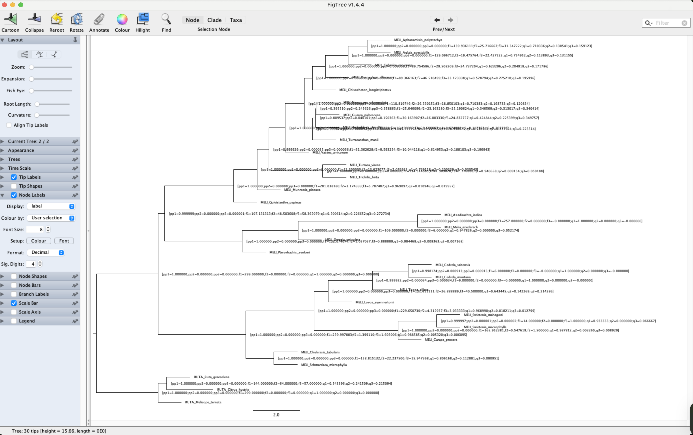

	How to read those labels/annotations:

	* q1 = normalized quartet support for the species-tree

	* q2, q3 = quartet support for the two alternative topologies

	* pp1 = local posterior probability for the species-tree 

	* pp2, pp3 = local posterior probabilities for the two alternatives (and pp1+pp2+pp3 ≈ 1)
	
	* f1 = total number of induced quartets across all gene trees that support the species-tree

	* f2, f3 = total quartets supporting for the two alternative topologies

	
	And now let's run Phytop

		conda activate phytop

		QT_QPA_PLATFORM=offscreen DISPLAY= MPLBACKEND=Agg phytop meliaceae_334_MO_orthologs.ASTRAL.u2.tre
		
	You should start seeing:
	
	
		26-02-24 15:42:25 [INFO] No DRMAA (see https://github.com/pygridtools/drmaa-python), Switching to local mode.
		26-02-24 15:42:26 [INFO] Command: /home/mpemaster/miniconda3/envs/phytop/bin/phytop meliaceae_334_MO_orthologs.ASTRAL.u2.tre
		26-02-24 15:42:26 [INFO] Version: 0.3
		26-02-24 15:42:26 [INFO] Arguments: {'astral': 'meliaceae_334_MO_orthologs.ASTRAL.u2.tre', 'alter': None, 'genetrees': None, 'align': False, 'cp': False, 'branch_size': 48, 'leaf_size': 60, 'sort': False, 'notext': False, 'figsize': 3, 'fontsize': 13, 'figfmt': 'png', 'colors': None, 'polytomy_test': False, 'pie': False, 'pie_size': 30, 'add_bl': False, 'test_clades': None, 'astral_bin': 'astral-pro', 'outgroup': None, 'clades': None, 'collapsed': None, 'onshow': None, 'noshow': None, 'subset': None, 'prefix': None, 'tmpdir': 'tmp'}
		26-02-24 15:42:26 [INFO] Clades info file: `tmp/meliaceae_334_MO_orthologs.ASTRAL.u2.tre.nodes.tsv`, which can be renamed and edited as input of `-clades`
		...
		...
		...
		...
		26-02-24 15:42:29 [INFO] Labeled tree file: `tmp/meliaceae_334_MO_orthologs.ASTRAL.u2.tre.label.tree`
		26-02-24 15:42:29 [INFO] Information file: `meliaceae_334_MO_orthologs.ASTRAL.u2.tre.info.tsv`
		26-02-24 15:42:29 [INFO] Final plot: `meliaceae_334_MO_orthologs.ASTRAL.u2.tre.pdf`
		
	Phytop should be done in few seconds!
	
	The main output of Phytop is the `meliaceae_334_MO_orthologs.ASTRAL.u2.tre.pdf` file. Let's download it to our local computers
	
	#### THIS NEEDS TO BE TYPED IN A WINDOW ON YOUR LOCAL COMPUTER, NOT WHILE YOU ARE CONNECTED TO THE WORKSTATION. JUST OPEN A NEW TERMINAL WINDOW.

	scp -P 22110 USERNAME@10.153.134.10:/data_tmp/$USERNAME/data/07_phylogenomic_analyses/14_phytop/meliaceae_334_MO_orthologs.ASTRAL.u2.tre.pdf .
	
	The file should look like this:
	
	
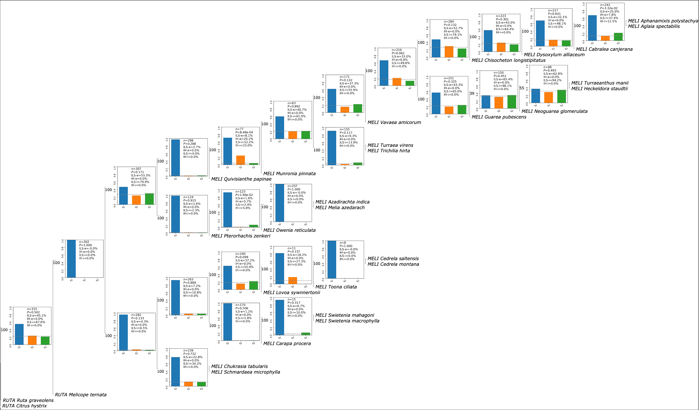

		
	You can zoom-in to see the details for each node (e.g, the MRCA of Meliaceae and the next nodes)
	
	
	
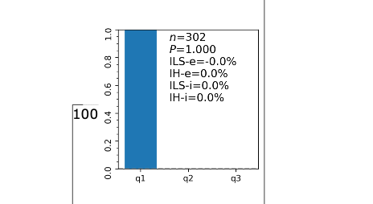
 
	
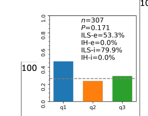

		
	What can you say about those values. Remember:
	
	* *n* represents the number gene trees

	* *P* is the P-value of the χ2 test to check whether the number of topologies q2 and q3 are equal

	* ILS-i and IH-i represent the calculated ILS and IH indices, respectively

	* ILS-e and IH-e represent the proportion of gene tree topological incongruence that can be explained by ILS and IH, respectively 

	*	**ILS-i** = how strong ILS is on that branch, scaled 0–100% 

	*	**ILS-e** = how much of the observed discordant gene trees (q2 ≈ q3) can be attributed to ILS

	*	**IH-i**  = how strong the asymmetric introgression/hybridization signal is, scaled 0–50%

	*	**IH-e** = the excess discordance attributable to that asymmetry (q2 ≠ q3)
		
		#### What patterns do you see? 

## Inferring phylogenetic networks with Phylonet

* We are going to infer phylogenetic networks with Phylonet using ortholog gene trees as input, but we need to keep in mind a few practical considerations:

	* Inferring phylogenetic networks is very computational intensive and is restricted to a maximum number of samples (10 - 20). The phylogenetic network space is much larger than that of trees on the same number of taxa.
	
	* Runtime grows explosively with the number of taxa and the number of reticulations you allow, is better to restrict to a small number of reticulations. Start with h = 0, 1, 2 and increase only if you have strong evidence and the fit improves meaningfully.
	
	* Usually we need to reduced our sampling to test specific hypothesis of hybridization based on previous knowledge (e.g., morphology) or phylogenetic patterns (e.g. gene tree discordance). So serach for networks focused on clades (or representative taxa), not “whole-tree” datasets with dozens+ taxa.
	
	* PhyloNet expects rooted gene trees. Wrong roots or inconsistent rooting can look like gene flow.
	

	All this being said, in this example we will focus for potential reticulations on the backbone of the family, based on our conflict analyses.
	
	
	

	
	

	
	

	
	Based on the discordance patters, we are going to test if there is potential hybridization among three clades: Cedreloideae, Meliaeae, and the remaining of Melioideae.
	
	Given that this clades have high support, we are going to choose *two* samples from each clade and *one* outgroup to to root all gene trees. We will do based on the number of orthologs per sample. We well choose the taxa for each clade and outgroup that have the highest number of orthologs
	
	
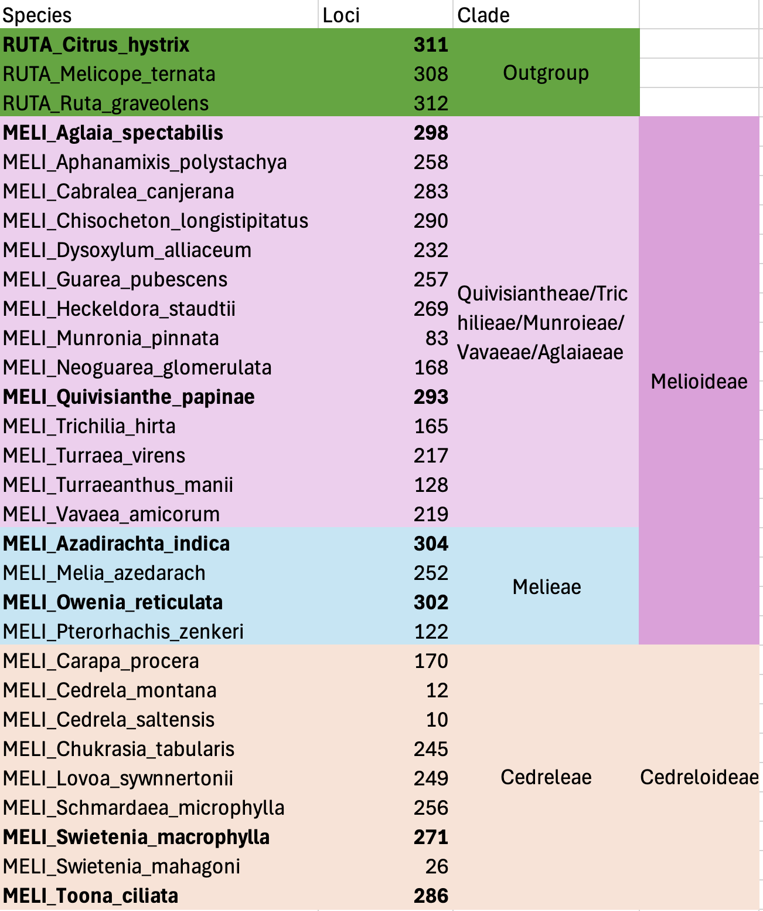

	
	Based on this stats we will work the following 7 species:
	
	* RUTA_Citrus_hystrix
	* MELI_Quivisianthe_papinae
	* MELI_Aglaia_spectabilis
	* MELI_Owenia_reticulata
	* MELI_Azadirachta_indica
	* MELI_Swietenia_macrophylla
	* MELI_Toona_ciliata
	
	
	We will put this names in a file called `taxa_to_keep.txt`
	
	First let's create the directories where we will be working
	
		cd /data_tmp/$USERNAME/data/07_phylogenomic_analyses/
	
		mkdir -p 15_phylonet/00_reduced_fasta

		cd 15_phylonet
		
	Write the text file with the samples to keep
	

		printf "%s\n" \
  		"RUTA_Citrus_hystrix" \
  		"MELI_Quivisianthe_papinae" \
  		"MELI_Aglaia_spectabilis" \
  		"MELI_Owenia_reticulata" \
  		"MELI_Azadirachta_indica" \
  		"MELI_Swietenia_macrophylla" \
  		"MELI_Toona_ciliata" \
  		> taxa_to_keep.txt
  		
  	Open the file to verify
  	
  		cat taxa_to_keep.txt
  		
  	It should look like this:
  	
  		RUTA_Citrus_hystrix
		MELI_Quivisianthe_papinae
		MELI_Aglaia_spectabilis
		MELI_Owenia_reticulata
		MELI_Azadirachta_indica
		MELI_Swietenia_macrophylla
		MELI_Toona_ciliata
	
	The next step is to write ortholog FASTA files for only those samples. 
	
	It is important to notice that the scrip `keep_taxa_from_fasta_files.py` will keep only FASTA files that have all 7 samples (i.e, no missing taxa). This is important as the maximum likelihood method we will use in Phylonet does not allow for missing data.

		python /data_tmp/$USERNAME/script/keep_taxa_from_fasta_files.py /data_tmp/$USERNAME/data/07_phylogenomic_analyses/06_MO_fasta_files fa taxa_to_keep.txt 00_reduced_fasta/
		
	Verify that you have the output files
	
		cd 00_reduced_fasta
		
		ls
		
	You should have
	
		4691.ortho.rd.fa  5404.ortho.rd.fa  5822.ortho.rd.fa  6119.ortho.rd.fa ...
		
	Count how many files you have 
	
		ls *.fa | wc -l
		
	You should have `234`		
	
	Now, we need to align, clean the alignment, and infer ML trees for each of this
	
	Run the alignments. It should take a couple of minutes
	
		conda activate captus
	
		parallel -j 4 'mafft --auto --thread 1 {} > "$(cut -d. -f1 <<<"{}").mafft.aln"' ::: *.fa

	Clean the alignments. It should be very fast
	

		parallel -j 4 'clipkit {} -m smart-gap -o  "$(cut -d. -f1-2 <<<"{}").clipkit"' ::: *.aln

	And finally infer the ML trees. This should take 3 to 5 minutes
	
		parallel -j 2 '
 		p="$(cut -d. -f1 <<<"{}")"
  		iqtree -m MFP -s "{}" -T 2 --seqtype DNA --prefix "${p}.iqtree"
  		rm -f "${p}.iqtree.bionj" \
        "${p}.iqtree.ckp.gz" \
        "${p}.iqtree.log" \
        "${p}.iqtree.mldist" \
        "${p}.iqtree.model.gz" \
        "${p}.iqtree.uniqueseq.phy" \
        "${p}.iqtree.contree" \
        "${p}.iqtree.splits.nex"
		' ::: *.clipkit
		
	Now, we are ready to prepare the files for running PhyloNet
	
		cd /data_tmp/$USERNAME/data/07_phylogenomic_analyses/14_phylonet

		
	Let's make a new directory were we will be running PhyloNet
	
		
		mkdir 01_phylonet_run

		cd 01_phylonet_run

	Now, we need to put all gene trees from the previous step in a single file	
		
		cat ../00_reduced_fasta/*.treefile > meliaceae_234_MO_7taxa.tre
		
		
	We need to root the trees. In this call all with `RUTA_Citrus_hystrix`
	

		pxrr -g RUTA_Citrus_hystrix -t meliaceae_234_MO_7taxa.tre -o meliaceae_234_MO_7taxa.tre.rr
		
		
	Check that all you less are rooted
	
		less meliaceae_234_MO_7taxa.tre.col_20.tre
		
	You should see that all trees start with `RUTA_Citrus_hystrix`
	
		(RUTA_Citrus_hystrix:0.24371,((MELI_Swietenia_macrophylla:0.10105,MELI_Toona_ciliata:0.05406):0.04224,((MELI_Azadirachta_indica:0.02627,MELI_Owenia_reticulata:0.03820):0.15593,(MELI_Aglaia_spectabilis:0.10274,MELI_Quivisianthe_papinae:0.34948):0.06033):0.04099):0.24371):0.00000;
		(RUTA_Citrus_hystrix:0.12483,(((MELI_Azadirachta_indica:0.03651,MELI_Owenia_reticulata:0.01205):0.06432,(MELI_Swietenia_macrophylla:0.04178,MELI_Toona_ciliata:0.03107):0.00523):0.11575,(MELI_Aglaia_spectabilis:0.02761,MELI_Quivisianthe_papinae:0.17835):0.07330):0.12483):0.00000;
		(RUTA_Citrus_hystrix:0.08756,(((MELI_Azadirachta_indica:0.01473,MELI_Owenia_reticulata:0.04151):0.05463,(MELI_Swietenia_macrophylla:0.04529,MELI_Toona_ciliata:0.04864):0.03597):0.00351,(MELI_Aglaia_spectabilis:0.08716,MELI_Quivisianthe_papinae:0.06134):0.03469):0.08756):0.00000;
		(RUTA_Citrus_hystrix:0.09815,(MELI_Toona_ciliata:0.07655,((MELI_Quivisianthe_papinae:0.05866,MELI_Swietenia_macrophylla:0.33412):0.22345,(MELI_Aglaia_spectabilis:0.13531,(MELI_Azadirachta_indica:0.03499,MELI_Owenia_reticulata:0.03734):0.06877):0.02018):0.01268):0.09815):0.00000;
		(RUTA_Citrus_hystrix:0.11093,((MELI_Azadirachta_indica:0.02163,MELI_Owenia_reticulata:0.03328):0.07231,((MELI_Swietenia_macrophylla:0.07030,MELI_Toona_ciliata:0.03172):0.03767,(MELI_Aglaia_spectabilis:0.08539,MELI_Quivisianthe_papinae:0.10172):0.02092):0.00770):0.11093):0.00000;
		...
		
		
	Similar to ASTRAL we can collapse nodes wih low support (< 20%)
	
	
		python /data_tmp/$USERNAME/script/collapse_branches_bs_multiphylo.py meliaceae_234_MO_7taxa.tre.rr 20
		
	Next, we need to format the previous file with the 234 trees into a NEXUS file for PhyloNet 
		

		awk '{ print FNR " = " $0 }' meliaceae_234_MO_7taxa.tre.col_20.tre | sed -e 's/^/tree tree_/' > meliaceae_234_MO_7taxa.nex
		sed -i -e '1s/^/#NEXUS\nBEGIN TREES;\n/' meliaceae_234_MO_7taxa.nex
		sed -i -e '$aEND;\nBEGIN PHYLONET;\nInferNetwork_ML (all) 1 -x 50 -n 1 -di -pl 4 meliaceae_234_MO_7taxa.phylonet_MP_1hyb.txt;\nEND;' meliaceae_234_MO_7taxa.nex

	Check the format of the NEXUS file `meliaceae_234_MO_7taxa.nex`
	
		less meliaceae_234_MO_7taxa.nex
		
	You should see:
	
		#NEXUS
		BEGIN TREES;
		tree tree_1 = (RUTA_Citrus_hystrix:0.24371,((MELI_Swietenia_macrophylla:0.10105,MELI_Toona_ciliata:0.05406):0.04224,((MELI_Azadirachta_indica:0.02627,MELI_Owenia_reticulata:0.03820):0.15593,(MELI_Aglaia_spectabilis:0.10274,MELI_Quivisianthe_papinae:0.34948):0.06033):0.04099):0.24371):0.00000;
		tree tree_2 = (RUTA_Citrus_hystrix:0.12483,(((MELI_Azadirachta_indica:0.03651,MELI_Owenia_reticulata:0.01205):0.06432,(MELI_Swietenia_macrophylla:0.04178,MELI_Toona_ciliata:0.03107):0.00523):0.11575,(MELI_Aglaia_spectabilis:0.02761,MELI_Quivisianthe_papinae:0.17835):0.07330):0.12483):0.00000;
		tree tree_3 = (RUTA_Citrus_hystrix:0.08756,(((MELI_Azadirachta_indica:0.01473,MELI_Owenia_reticulata:0.04151):0.05463,(MELI_Swietenia_macrophylla:0.04529,MELI_Toona_ciliata:0.04864):0.03597):0.00351,(MELI_Aglaia_spectabilis:0.08716,MELI_Quivisianthe_papinae:0.06134):0.03469):0.08756):0.00000;
		...
		...
		...
		tree tree_234 = (RUTA_Citrus_hystrix:0.10816,((MELI_Swietenia_macrophylla:0.18517,MELI_Toona_ciliata:0.03895):0.10109,((MELI_Azadirachta_indica:0.02865,MELI_Owenia_reticulata:0.04316):0.10518,(MELI_Aglaia_spectabilis:0.11507,MELI_Quivisianthe_papinae:0.12344):0.03132):0.00955):0.10816):0.00000;
		END;
		BEGIN PHYLONET;
		InferNetwork_ML (all) 1 -x 50 -n 1 -di -pl 4 meliaceae_234_MO_7taxa.phylonet_MP_1hyb.txt;
		END;	

	A NEXUS file always starts with `#NEXUS` and then it has difference blocks. Block start with `BEGIN block_name;` and ends with `END;`
	
	Here we have the `TREES` block where you list and number the trees and the `PHYLONET` block where you provide the command you want to run in Phylonet. For more details of the NEXUS format for PhyloNet see [here](https://phylogenomics.rice.edu/html/phylonetOverview.html)
	
	In this case our PhyloNet command is `InferNetwork_ML (all) 1 -x 50 -n 1 -di -pl 4 meliaceae_234_MO_7taxa.phylonet_MP_1hyb.txt` This means
	
	* InferNetwork_ML: Infers a phylogenetic network from gene trees under maximum likelihood.
	
	* numReticulations: In this case is `1`
	
	* (all): geneTreeList. Here we are using all tree, but it could be omma delimited list of gene tree identifiers or comma delimited list of sets of gene tree identifiers.
		
	* -x numRuns: The number of runs of the search. Default value is 5.
	
	* -n numNetReturned: Number of optimal networks to return. Default value is 1.
	
	* -di: Output the Rich Newick string of the inferred network that can be read by Dendroscope.
	
	* -pl numProcessors: Number of processors if you want the computation to be done in parallel. Default value is 1.
	
	* meliaceae_234_MO_7taxa.phylonet_MP_1hyb.txt: This is the output file name with the networks and ML score
	
	All other options are the default ones. For all Phylonet settings see [here](https://phylogenomics.rice.edu/html/commands/InferNetwork_ML.html)
	
	We can run PhyloNet now:
	
		java -jar /data_tmp/$USERNAME/apps/phylonet/PhyloNet.3.8.4.jar meliaceae_234_MO_7taxa.nex 
		
	You should start seeing:
	
		InferNetwork_ML (tree_234, tree_233, tree_232, tree_231, tree_230, tree_229, tree_228, tree_227, tree_226, tree_225, tree_224, tree_223, tree_222, tree_221, tree_220, tree_219, tree_218, tree_217, tree_216, tree_215, tree_214, tree_213, tree_212, tree_211, tree_210, tree_209, tree_208, tree_207, tree_206, tree_205, tree_204, tree_203, tree_202, tree_201, tree_200, tree_199, tree_198, tree_197, tree_196, tree_195, tree_194, tree_193, tree_192, tree_191, tree_190, tree_189, tree_188, tree_187, tree_186, tree_185, tree_184, tree_183, tree_182, tree_181, tree_180, tree_179, tree_178, tree_177, tree_176, tree_175, tree_174, tree_173, tree_172, tree_171, tree_170, tree_169, tree_168, tree_167, tree_166, tree_165, tree_164, tree_163, tree_162, tree_161, tree_160, tree_159, tree_158, tree_157, tree_156, tree_155, tree_154, tree_153, tree_152, tree_151, tree_150, tree_149, tree_148, tree_147, tree_146, tree_145, tree_144, tree_143, tree_142, tree_141, tree_140, tree_139, tree_138, tree_137, tree_136, tree_135, tree_134, tree_133, tree_132, tree_131, tree_130, tree_129, tree_128, tree_127, tree_126, tree_125, tree_124, tree_123, tree_122, tree_121, tree_120, tree_119, tree_118, tree_117, tree_116, tree_115, tree_114, tree_113, tree_112, tree_111, tree_110, tree_109, tree_108, tree_107, tree_106, tree_105, tree_104, tree_103, tree_102, tree_101, tree_100, tree_99, tree_98, tree_97, tree_96, tree_95, tree_94, tree_93, tree_92, tree_91, tree_90, tree_89, tree_88, tree_87, tree_86, tree_85, tree_84, tree_83, tree_82, tree_81, tree_80, tree_79, tree_78, tree_77, tree_76, tree_75, tree_74, tree_73, tree_72, tree_71, tree_70, tree_69, tree_68, tree_67, tree_66, tree_65, tree_64, tree_63, tree_62, tree_61, tree_60, tree_59, tree_58, tree_57, tree_56, tree_55, tree_54, tree_53, tree_52, tree_51, tree_50, tree_49, tree_48, tree_47, tree_46, tree_45, tree_44, tree_43, tree_42, tree_41, tree_40, tree_39, tree_38, tree_37, tree_36, tree_35, tree_34, tree_33, tree_32, tree_31, tree_30, tree_29, tree_28, tree_27, tree_26, tree_25, tree_24, tree_23, tree_22, tree_21, tree_20, tree_19, tree_18, tree_17, tree_16, tree_15, tree_14, tree_13, tree_12, tree_11, tree_10, tree_9, tree_8, tree_7, tree_6, tree_5, tree_4, tree_3, tree_2, tree_1) 1 -x 5 -n 1 -di -pl 4 meliaceae_234_MO_7taxa.phylonet_MP_1hyb.txt
	
		Results after run #1
		-359.6740707895197: (RUTA_Citrus_hystrix:3.520428454788389,((MELI_Toona_ciliata:2.8418097235696713,MELI_Swietenia_macrophylla:1.4999915229632703)I4:3.418836653228526,((MELI_Owenia_reticulata:1.2123771231871079,MELI_Azadirachta_indica:1.1242738519699988)I0:5.775145337913473,(MELI_Aglaia_spectabilis:1.542487031943315,MELI_Quivisianthe_papinae:0.03421451045036398)I6:2.460447769760712)I2:0.19283462668211412)I5:6.835051164953911)I3;
		Running Time (min): 0.2549
		===============================

		Results after run #2
		-359.6740707895197: (RUTA_Citrus_hystrix:3.520428454788389,((MELI_Toona_ciliata:2.8418097235696713,MELI_Swietenia_macrophylla:1.4999915229632703)I4:3.418836653228526,((MELI_Owenia_reticulata:1.2123771231871079,MELI_Azadirachta_indica:1.1242738519699988)I0:5.775145337913473,(MELI_Aglaia_spectabilis:1.542487031943315,MELI_Quivisianthe_papinae:0.03421451045036398)I6:2.460447769760712)I2:0.19283462668211412)I5:6.835051164953911)I3;
		Running Time (min): 0.06973333333333333
		===============================
		
		....
		....
		....
		
		
	It should take 6 to 7 minutes until is done and you see: 
	
	
		Writing output to /data_tmp/mpeuser1/data/07_phylogenomic_analyses/14_phylonet/01_phylonet_run/meliaceae_234_MO_7taxa.phylonet_MP_1hyb.txt
		
	Now let's see check the output file:
	
		cat meliaceae_234_MO_7taxa.phylonet_MP_1hyb.txt
		
	You must see:
	
		Inferred Network #1:
		(((((MELI_Azadirachta_indica:1.0,MELI_Owenia_reticulata:1.0):5.910215392566465,((MELI_Toona_ciliata:1.0,MELI_Swietenia_macrophylla:1.0):3.522429226305039)#H1:0.1081119594192225::0.7480106968170107):0.05609038130521103,(MELI_Aglaia_spectabilis:1.0,MELI_Quivisianthe_papinae:1.0):2.4598415999678536):5.934452837555024,#H1:5.933834541137582::0.2519893031829893):5.9114640643849405,RUTA_Citrus_hystrix:1.0);
		Total log probability: -354.31731840323835
		Visualize in Dendroscope : (((((MELI_Azadirachta_indica,MELI_Owenia_reticulata),((MELI_Toona_ciliata,MELI_Swietenia_macrophylla))#H1),(MELI_Aglaia_spectabilis,MELI_Quivisianthe_papinae)),#H1),RUTA_Citrus_hystrix);

	* The fist line is the number of the network. In this case we only one to be returned.
	
	* The second line is the network in extended Newick format including the inheritance probabilities (gamma)
	
	* The third line is the ML score
	
	* The fourth line is the the network in extended Newick format without inheritance probabilities so it can be open in Dendroscope.
	
	We can plot the network now:
	
	* First we will do in in Dendroscpe
	
			grep "Visualize in Dendroscope" meliaceae_234_MO_7taxa.phylonet_MP_1hyb.txt | sed 's/Visualize in Dendroscope : //' | sed -E 's/Running.+//' > meliaceae_234_MO_7taxa.phylonet_MP_1hyb.dendroscope.txt

	You can either download this file or open it and copied directly on a text editor in you laptop and save it as `*.txt` files
	
			cat meliaceae_234_MO_7taxa.phylonet_MP_1hyb.dendroscope.txt
			
	You will get:
	
		(((((MELI_Azadirachta_indica,MELI_Owenia_reticulata),((MELI_Toona_ciliata,MELI_Swietenia_macrophylla))#H1),(MELI_Aglaia_spectabilis,MELI_Quivisianthe_papinae)),#H1),RUTA_Citrus_hystrix);
			
	Open Dendroscope on your laptop		
	
			
	

	Go to `File` -> `Open` and select your network file
	
	

	
	Then you should see something like this.
	
	
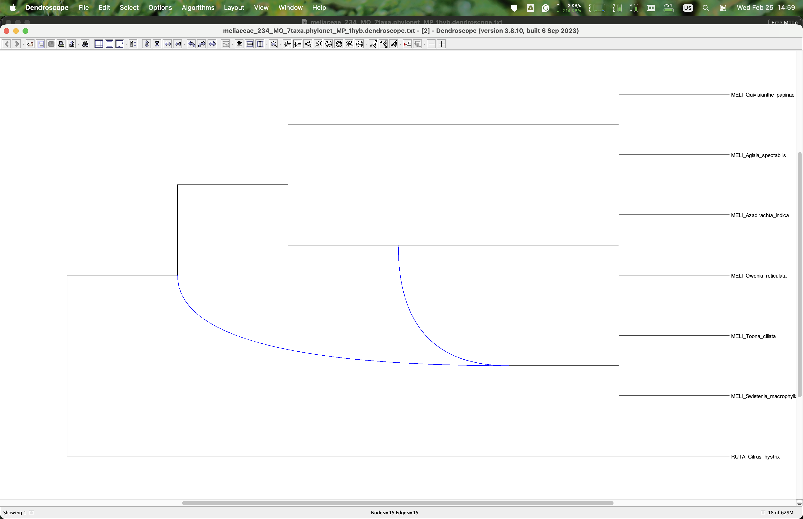

	
	The blue curve branches are connect the parental linage to the hybrid clade.
	
	**Keep in mind that you network might be different that the one showed here** Because the network search space is vastly larger than the tree search space, heuristic searches can converge on different local optima, so there is no guarantee of recovering the same network.

	Now lets plot the same network with `PhyloPlots` in `Julia`
	
	First let's extract the network

		grep -A 1 "Network" meliaceae_234_MO_7taxa.phylonet_MP_1hyb.txt | sed -E 's/Inferred.+//' | sed -E 's/^--//' | sed '/^$/d' > meliaceae_234_MO_7taxa.phylonet_MP_1hyb.phyloplots.txt

	Now let's open Julia and load the PhyloPlots and other necessary packages 
	
		conda activate Juila
		
		julia
		
	
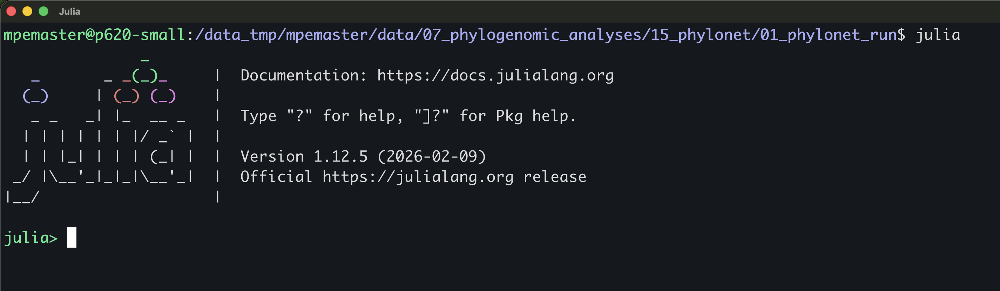

	
	While in `Julia` type:
	
	
		using PhyloNetworks;
		using PhyloPlots;
		using RCall;

		net = readTopology("meliaceae_234_MO_7taxa.phylonet_MP_1hyb.phyloplots.txt");
		R"pdf('meliaceae_234_MO_7taxa.phylonet_MP_1hyb.phyloplots.pdf', width=20, height=15)"
		R"par(mar = c(7, 7, 3, 3) + 0.1, xpd = NA)"
		plot(net, showgamma=true, minorhybridedgecolor="red")
		R"dev.off()"

	After is done you can exit `Julia`
	
		exit()

	And you should have the file `meliaceae_234_MO_7taxa.phylonet_MP_1hyb.phyloplots.pdf`
	
	Download this file to you laptop. Type this on you laptop.
	
		scp -P 22110 $USERNAME@10.153.134.10:/data_tmp/$USERNAME/data/07_phylogenomic_analyses/14_phylonet/01_phylonet_run/meliaceae_234_MO_7taxa.phylonet_MP_1hyb.phyloplots.pdf ~/Desktop
	
	You should see

	
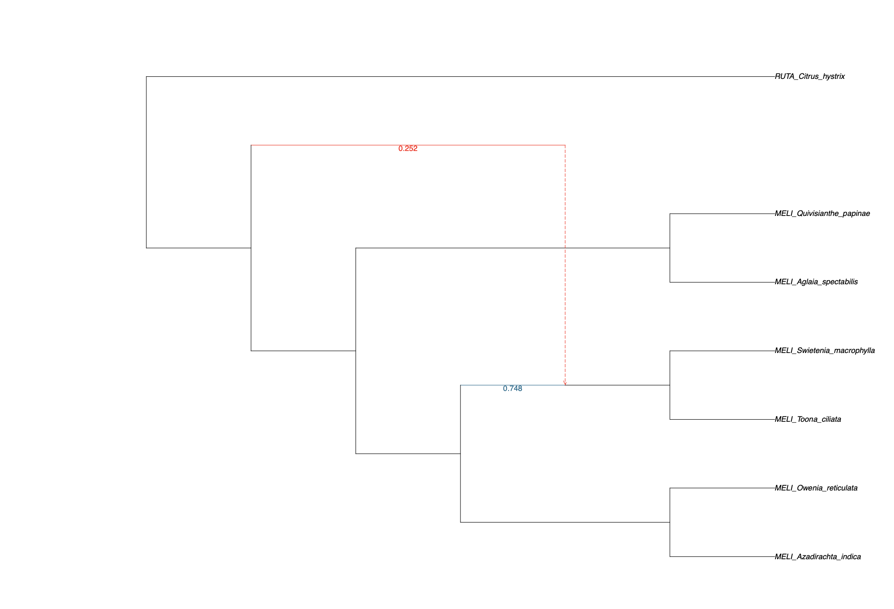

	
	The `blue` branch is the major edge and the `red` one is the minor edge. The number next to the branches are the inheritance probabilities. 

## Choosing the optimal number of reticulations using model selection

	
* In the previous section we infer a network allowing up to a single reticulation event. In many cases we want to explore if there additional reticulation events. If more reticulation events are inferred then we need to decide which of the tree topologies/networks explains better our data. For this we will use model selection using the Akaike Information Criterion (AIC), the correct Akaike Information Criterion (AICc), and Bayesian information criterion (BIC) criteria.

	I have inferred networks allowing from 0 to 3 reticulation events, using `-x 100`, and additionally I use the parameter `-po` . If `po` is specified, after the search the returned species networks will be optimized for their branch lengths and inheritance probabilities.
	
	These searches are more exhaustive the one we did in the previous section and take some time to run.
	
	You can see the input file and output files in `/data_tmp/$USERNAME/output/04_analyses/14_phylonet/01_phylonet_run`
	
		meliaceae_234_MO_7taxa.nex                           meliaceae_234_MO_7taxa.phylonet_MP_3hyb_x100_po.txt
		meliaceae_234_MO_7taxa.phylonet_MP_0hyb_x100_po.txt  meliaceae_234_MO_7taxa.tre
		meliaceae_234_MO_7taxa.phylonet_MP_1hyb_x100_po.txt  meliaceae_234_MO_7taxa.tre.col20.rr
		meliaceae_234_MO_7taxa.phylonet_MP_2hyb_x100_po.txt  meliaceae_234_MO_7taxa.tre.rr

	No we have 4 competing topologies. You can see then in file `meliaceae_234_MO_7taxa.4_networks.txt`
	
		(RUTA_Citrus_hystrix:1.0,(((MELI_Azadirachta_indica:1.0,MELI_Owenia_reticulata:1.0):5.908816609394323,(MELI_Quivisianthe_papinae:1.0,MELI_Aglaia_spectabilis:1.0):2.428930149018744):0.22667612950183902,(MELI_Swietenia_macrophylla:1.0,MELI_Toona_ciliata:1.0):3.5563114636082873):5.907379593597826);
		(((((MELI_Azadirachta_indica:1.0,MELI_Owenia_reticulata:1.0):5.910215392566465,((MELI_Toona_ciliata:1.0,MELI_Swietenia_macrophylla:1.0):3.522429226305039)#H1:0.1081119594192225::0.7480106968170107):0.05609038130521103,(MELI_Aglaia_spectabilis:1.0,MELI_Quivisianthe_papinae:1.0):2.4598415999678536):5.934452837555024,#H1:5.933834541137582::0.2519893031829893):5.9114640643849405,RUTA_Citrus_hystrix:1.0);
		(((((MELI_Owenia_reticulata:1.0,MELI_Azadirachta_indica:1.0):5.9116998330472965,((MELI_Swietenia_macrophylla:1.0,MELI_Toona_ciliata:1.0):3.571260198221916)#H1:5.913617835493971::0.15609927212144223):0.49668873216770765,(MELI_Quivisianthe_papinae:1.0,MELI_Aglaia_spectabilis:1.0):2.4123232623185):0.3419515191839638,#H1:0.0011774181844964955::0.8439007278785577):5.909269690061616,RUTA_Citrus_hystrix:1.0);
		((((((MELI_Toona_ciliata:1.0,MELI_Swietenia_macrophylla:1.0):3.267034079783416)#H1:5.939448425825783::0.4639844754207225,((MELI_Azadirachta_indica:1.0,MELI_Owenia_reticulata:1.0):5.910596258611644)#H2:5.91362142232495::0.695073175568802):0.6739068516334125,(MELI_Aglaia_spectabilis:1.0,MELI_Quivisianthe_papinae:1.0):2.196601040325424):5.9272280967344555,(#H1:1.1458980337503157::0.5360155245792775,#H2:5.913621677480962::0.30492682443119795):0.0011774181844964955):5.909735833906478,RUTA_Citrus_hystrix:1.0);
	
	You can plot these networks the same way we did in the previous section with `Julia`
	
	
		conda activate julia
		
		julia
		
		
		using PhyloNetworks;
		using PhyloPlots;
		using RCall;

		nets = readMultiTopology("meliaceae_234_MO_7taxa.4_networks.txt");
		R"pdf('meliaceae_234_MO_7taxa.4_networks.pdf', width=20, height=15)"
		R"par(mar = c(7, 7, 3, 3) + 0.1, xpd = NA)"
		R"layout(matrix(1:4, nrow = 2, byrow = TRUE))"
		plot(nets[1], showgamma=true, minorhybridedgecolor="red");
		plot(nets[2], showgamma=true, minorhybridedgecolor="red");
		plot(nets[3], showgamma=true, minorhybridedgecolor="red");
		plot(nets[4], showgamma=true, minorhybridedgecolor="red");
		R"dev.off()"

	
	You should have something like this
	
	
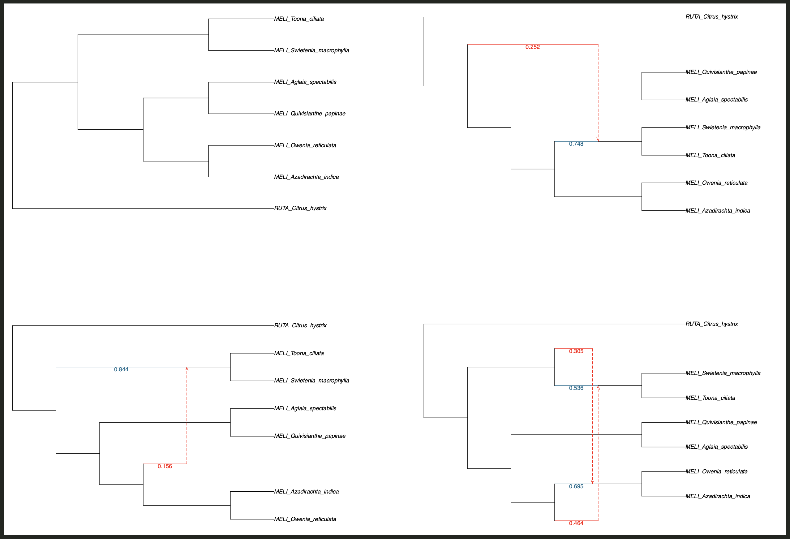

	
	Or if you use Dendroscope and the file `meliaceae_234_MO_7taxa.4_networks_dendro.txt`
	
	
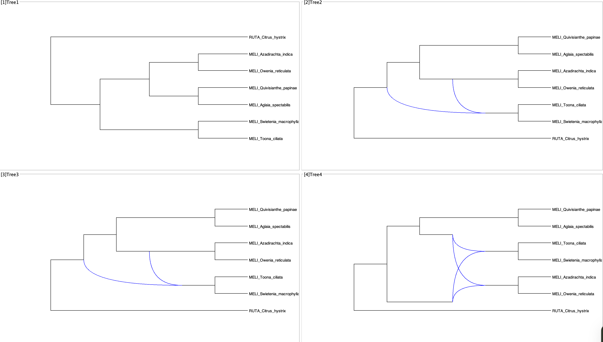

	
	**Note that allowing for a X number of reticulation it does not mean necessary that the return network will have that same number of reticulations**
	
	Now we can extract see the "Total log probability" for each network
	
		grep "Total log probability:" *_x100_po.txt
		
	You will see:
	
		meliaceae_234_MO_7taxa.phylonet_MP_0hyb_x100_po.txt:Total log probability: -358.2337599703988
		meliaceae_234_MO_7taxa.phylonet_MP_1hyb_x100_po.txt:Total log probability: -354.31731840323835
		meliaceae_234_MO_7taxa.phylonet_MP_2hyb_x100_po.txt:Total log probability: -356.8842603996508
		meliaceae_234_MO_7taxa.phylonet_MP_3hyb_x100_po.txt:Total log probability: -350.3919133667564
		
	With this values and the number of parameter we can proceed to do model selection.
	
	The nubmer of parameters <em>k</em> is crucial to get it correct. The number of parameters is easy to calculate. 
	
	* For bifurcating trees, it is just the number of total branches, in this case,  `2t-3`, where `t` is the number of tips. 
	* For networks, it is the number of branches plus the number of inheritance probabilities that are being estimated (always two per each hybridization event), so that would be `(2t-3)+(2h)`, where `h` is the number of hybridizations in the network. 
	
	
	I follow [Yu et al. 2012](https://journals.plos.org/plosgenetics/article?id=10.1371/journal.pgen.1002660#s5) for this. They give details of this in the supplemental material.
	
	So we have that <em>L</em> is the log likelihood score, <em>k</em> is the number of parameters, and <em>n</em> is the number of gene trees used to estimated the likelihood.
score.

	We can use the following formulas to calculate AIC, AICc, and BIC		

	
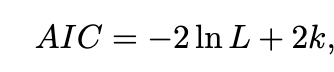

	
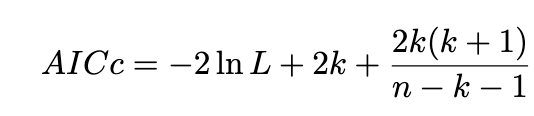

	
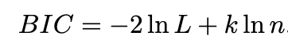

	
	The difference between the BIC and the AIC is the greater penalty imposed for the number of parameters by the former than the latter.

	**The lower the values of these criteria, the better the fit of the model to the data.**
	
	To assess the strength of evidence for the each candidate model we can use the delta values. Which is the difference between the candidate (alternative) models and the best model.
	
	In the delta AIC and AICc rule of thumb:
	
	* Less than 2, this indicates there is substantial evidence to support the candidate model (i.e., the candidate model is almost as good as the best model).
	* Between 4 and 7, this indicates that the candidate model has considerably less support.
	* Greater than 10, this indicates that there is essentially no support for the candidate model (i.e., it is unlikely to be the best model).

	For delta BIC, the rule of thumb is:
	
	* Less than 2, it is not worth more than a bare mention.
	* Between 2 and 6, the evidence against the candidate model is positive.
	* Between 6 and 10, the evidence against the candidate model is strong.
	* Greater than 10, the evidence is very strong.
	
	I have provided the spreadsheet with the calculations seen below in the Moddle's directory for today.
	
	
	
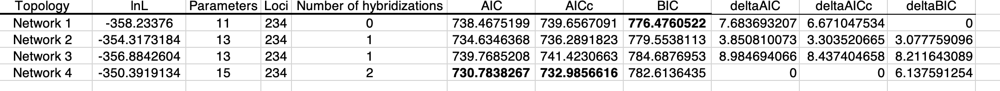

		
	**How do you interpret this result and put them in context of the pattern of WGD and discordance we have identified**

	
	
	